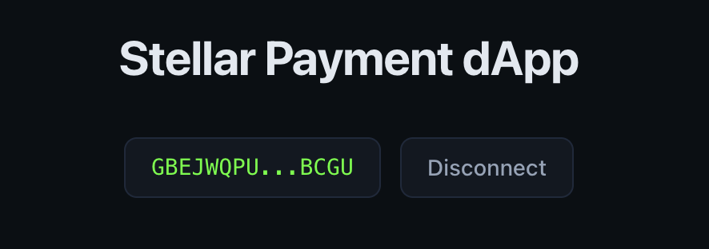
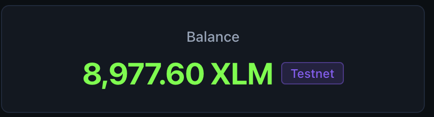
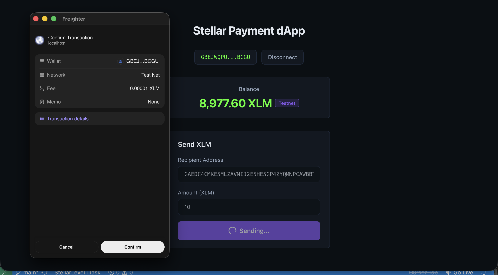
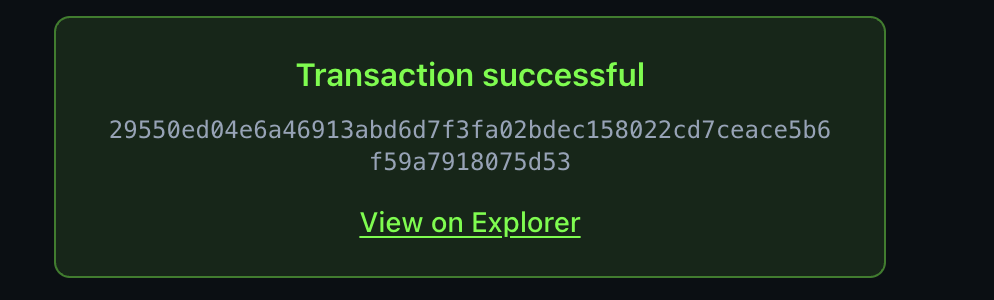

# Stellar Payment dApp

A React + TypeScript dApp for the **Stellar Testnet**. Connect your Freighter wallet, view your native XLM balance, and send payments — all from the browser.

Built with Vite, Tailwind CSS, `@stellar/stellar-sdk`, and `@stellar/freighter-api`. Network settings (Horizon URL, passphrase) are hardcoded for Testnet in `src/lib/stellar.ts` — no mainnet, no `.env` required.

## Tech Stack

- **Vite** — build tool and dev server
- **React 19** + **TypeScript**
- **Tailwind CSS v4** — dark theme UI
- **@stellar/stellar-sdk** — Horizon API, transaction building
- **@stellar/freighter-api** — wallet connect and transaction signing

## Features

- **Wallet connect / disconnect** — Freighter integration with session restore on page refresh
- **Balance display** — native XLM balance fetched via Horizon Testnet
- **Send XLM** — build, sign (Freighter), and submit payment transactions on Testnet
- **Transaction feedback** — success/error state with explorer link to transaction hash

## Setup

### 1. Clone the repository

```bash
git clone https://github.com/deusdotdev/StellarLevel1Task.git
cd StellarLevel1Task
```

### 2. Install dependencies

This project uses **npm** (`package-lock.json` is included).

```bash
npm install
```

### 3. Start the dev server

```bash
npm run dev
```

Open the URL shown in the terminal (default: `http://localhost:5173`).

### Freighter wallet (required)

1. Install the [Freighter browser extension](https://www.freighter.app/)
2. Create or import a wallet and **switch the network to Testnet** (not Mainnet)
3. Fund your Testnet account if needed via [Friendbot](https://friendbot.stellar.org/?addr=YOUR_PUBLIC_KEY)

## Usage

1. Click **Connect Wallet** and approve the Freighter permission prompt
2. Your **XLM balance** appears below the wallet address
3. Enter a **recipient address** (`G...`, 56 characters) and **amount** in the payment form
4. Click **Send** and confirm the transaction in Freighter
5. View the result — green success box with hash link, or a red error message

> **Note:** The recipient account must already exist on Testnet (funded at least once). New keypairs need Friendbot funding before they can receive payments.

## Screenshots

### Wallet Connected State



### Balance Displayed



### Successful Testnet Transaction



### Transaction Result Shown to User



## Project Structure

```
src/
├── hooks/
│   ├── useWallet.ts       # Freighter connect/disconnect logic
│   ├── useBalance.ts      # Horizon balance fetching
│   └── useSendPayment.ts  # Payment build, sign, and submit flow
├── components/
│   ├── ConnectButton.tsx  # Wallet connect/disconnect UI
│   ├── BalanceCard.tsx    # Balance display card
│   ├── PaymentForm.tsx    # Send XLM form
│   └── TxResult.tsx       # Transaction success/error feedback
├── lib/
│   └── stellar.ts         # Testnet constants, Horizon server, shared helpers
└── App.tsx                # Main layout and state orchestration
```

- **`hooks/`** — reusable state logic for wallet, balance, and payments
- **`components/`** — presentational UI wired to the hooks
- **`lib/stellar.ts`** — single source of truth for Testnet network config (`NETWORK_PASSPHRASE`, `HORIZON_URL`, `horizonServer`)

## Scripts

| Command         | Description              |
| --------------- | ------------------------ |
| `npm run dev`   | Start Vite dev server    |
| `npm run build` | Typecheck + production build |
| `npm run preview` | Preview production build |
| `npm run lint`  | Run Oxlint               |
